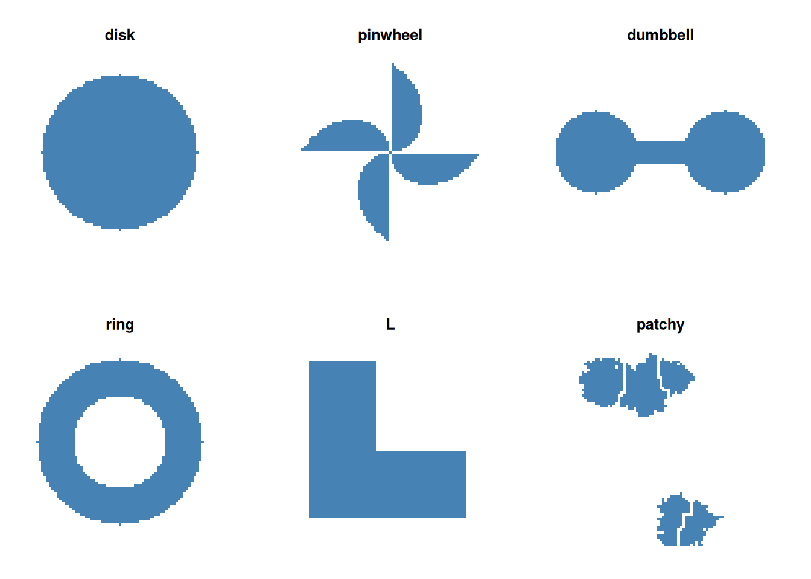
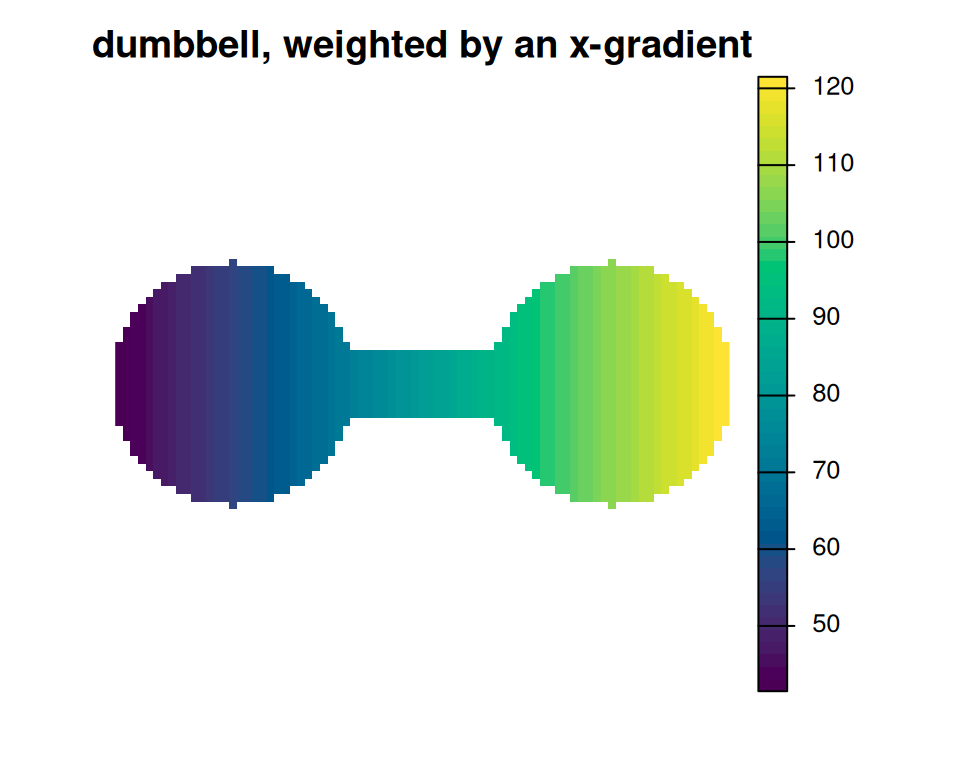
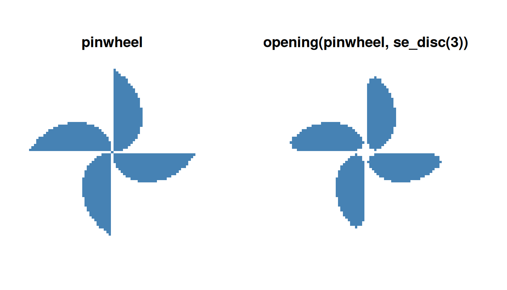

# 1. Basic Usage

``` r

library(gridmorph)
library(terra)
```

This vignette is a practical, code-first tour of the fifteen shape
indices: build a few synthetic raster shapes, run the indices on them
individually and all at once, and see what `weighted` changes.
`gridmorph` computes the same thirteen indices as its sibling package
`shapeindices` (which works on `sf` (multi)polygons instead of
rasters) - the underlying definitions and proofs are the same regardless
of representation, so they aren’t repeated here - plus two indices with
no vector-package analogue at all
([`gm_geodesic_span_index()`](https://nkaza.github.io/gridmorph/reference/gm_geodesic_span_index.md)
and
[`gm_geodesic_chord_index()`](https://nkaza.github.io/gridmorph/reference/gm_geodesic_chord_index.md),
mean distance along the shortest path CONFINED to the shape rather than
a straight line - see the “Geodesic indices” section below). For the
mathematical grounding - what “convexity” or “depth” even means, and
where each index breaks down - see `shapeindices`’ own
[`vignette("b-understanding-convexity-index", package = "shapeindices")`](https://nkaza.github.io/shapeindices/articles/b-understanding-convexity-index.html)
and its companions. For the six morphological operators
([`erode()`](https://nkaza.github.io/gridmorph/reference/erode.md),
[`dilate()`](https://nkaza.github.io/gridmorph/reference/dilate.md),
[`opening()`](https://nkaza.github.io/gridmorph/reference/opening.md),
[`closing()`](https://nkaza.github.io/gridmorph/reference/closing.md),
[`tophat()`](https://nkaza.github.io/gridmorph/reference/tophat.md),
[`bottomhat()`](https://nkaza.github.io/gridmorph/reference/bottomhat.md))
and how they behave across binary, continuous, and categorical rasters,
see
[`vignette("b-morphological-operators")`](https://nkaza.github.io/gridmorph/articles/b-morphological-operators.md).
For how `gridmorph` and `shapeindices` compare on accuracy, speed, and
memory, see
[`vignette("c-comparison-with-shapeindices")`](https://nkaza.github.io/gridmorph/articles/c-comparison-with-shapeindices.md).
Six of the fifteen indices compare the shape against a reference value
computed the same way the shape’s own score was, rather than a plain
textbook formula - see
[`vignette("d-resolution-matched-references")`](https://nkaza.github.io/gridmorph/articles/d-resolution-matched-references.md)
for why, and what a perfectly rasterized disk scores on each as a
result.

## 1 Six canonical shapes

Six small synthetic rasters, built directly from cell coordinates, cover
a useful range of shape behaviour: a **disk** (the reference shape every
index treats as optimal), a **pinwheel** (four spiky, rotationally
symmetric blades), a **dumbbell** (two round masses joined by a thin
bar), a **ring** (a disk with its centre hollowed out), an **L-shape**
(a simple right-angle notch), and a **patchy** raster (several disjoint
patches grown independently, never touching each other - a genuine
multi-part shape, the raster analogue of an `sf` MULTIPOLYGON). The
first five are single, connected pieces; `patchy` is not, and shows up
again in its own section below.

Code

``` r

make_disk <- function(n = 81, radius = 30) {
  r <- rast(nrows = n, ncols = n, xmin = 0, xmax = n, ymin = 0, ymax = n, crs = "local")
  cx <- init(r, "x") - n / 2; cy <- init(r, "y") - n / 2
  ifel(sqrt(cx^2 + cy^2) <= radius, 1, 0)
}

make_pinwheel <- function(n = 81, blades = 4, r_max = 35) {
  r <- rast(nrows = n, ncols = n, xmin = 0, xmax = n, ymin = 0, ymax = n, crs = "local")
  cx <- init(r, "x") - n / 2; cy <- init(r, "y") - n / 2
  theta <- (atan2(cy, cx) + 2 * pi) %% (2 * pi)
  sector_width <- 2 * pi / blades
  theta_local <- theta %% sector_width
  # each blade sweeps from a point (theta_local = 0) out to r_max
  # (theta_local = sector_width) - `blades` copies, evenly rotated
  ifel(sqrt(cx^2 + cy^2) <= r_max * (theta_local / sector_width), 1, 0)
}

make_dumbbell <- function(n = 81, r_ball = 16, bar_half_width = 4, gap = 50) {
  r <- rast(nrows = n, ncols = n, xmin = 0, xmax = n, ymin = 0, ymax = n, crs = "local")
  cx <- init(r, "x") - n / 2; cy <- init(r, "y") - n / 2
  ball1 <- sqrt((cx + gap / 2)^2 + cy^2) <= r_ball
  ball2 <- sqrt((cx - gap / 2)^2 + cy^2) <= r_ball
  bar   <- (cx >= -gap / 2) & (cx <= gap / 2) & (abs(cy) <= bar_half_width)
  ifel(ball1 | ball2 | bar, 1, 0)
}

make_ring <- function(n = 81, r_outer = 32, r_inner = 18) {
  r <- rast(nrows = n, ncols = n, xmin = 0, xmax = n, ymin = 0, ymax = n, crs = "local")
  cx <- init(r, "x") - n / 2; cy <- init(r, "y") - n / 2
  rad <- sqrt(cx^2 + cy^2)
  ifel(rad <= r_outer & rad >= r_inner, 1, 0)
}

make_L <- function(n = 81) {
  r <- rast(nrows = n, ncols = n, xmin = 0, xmax = n, ymin = 0, ymax = n, crs = "local")
  values(r) <- 0
  r[10:70, 10:35] <- 1
  r[45:70, 10:70] <- 1
  r
}

make_patchy <- function(n = 81,
                                 num_patches = 5,
                                 fill = 0.15,
                                 buffer = TRUE) {
    
    stopifnot(
        num_patches > 0,
        num_patches < n * n,
        fill > 0,
        fill <= 1
    )
    
    target <- max(num_patches, floor(fill * n * n))
    
    ## raster
    mat <- matrix(0L, n, n)
    
    ## random seeds
    seeds <- sample.int(n * n, num_patches)
    mat[seeds] <- seq_len(num_patches)
    
    ## maximum possible frontier size
    max_frontier <- 2L * target
    
    frontier_cell <- integer(max_frontier)
    frontier_id   <- integer(max_frontier)
    
    frontier_cell[seq_len(num_patches)] <- seeds
    frontier_id[seq_len(num_patches)]   <- seq_len(num_patches)
    
    nf <- num_patches
    occupied <- num_patches
    
    ## 4-neighbour growth
    dr <- c(-1L, 1L, 0L, 0L)
    dc <- c(0L, 0L, -1L, 1L)
    
    while (occupied < target && nf > 0L) {
        
        ## random frontier element
        i <- sample.int(nf, 1L)
        
        cell <- frontier_cell[i]
        pid  <- frontier_id[i]
        
        ## remove by swap
        frontier_cell[i] <- frontier_cell[nf]
        frontier_id[i]   <- frontier_id[nf]
        nf <- nf - 1L
        
        r <- ((cell - 1L) %% n) + 1L
        c <- ((cell - 1L) %/% n) + 1L
        
        ord <- sample.int(4)
        
        for (k in ord) {
            
            rr <- r + dr[k]
            cc <- c + dc[k]
            
            if (rr < 1L || rr > n || cc < 1L || cc > n)
                next
            
            if (mat[rr, cc] != 0L)
                next
            
            if (buffer) {
                
                rs <- max(1L, rr - 1L):min(n, rr + 1L)
                cs <- max(1L, cc - 1L):min(n, cc + 1L)
                
                nbr <- mat[rs, cs]
                
                if (any(nbr > 0L & nbr != pid))
                    next
            }
            
            ## occupy
            mat[rr, cc] <- pid
            occupied <- occupied + 1L
            
            ## current cell remains active
            nf <- nf + 1L
            frontier_cell[nf] <- cell
            frontier_id[nf]   <- pid
            
            ## new cell becomes active
            nf <- nf + 1L
            frontier_cell[nf] <- (cc - 1L) * n + rr
            frontier_id[nf]   <- pid
            
            break
        }
    }
    
    mat[mat == 0L] <- NA_integer_
    mat[mat>0] <- 1 # Remove this if you want to preserve the patch id.
    
    rast(mat, crs="local")
}

shapes <- list(disk = make_disk(), pinwheel = make_pinwheel(), dumbbell = make_dumbbell(),
               ring = make_ring(), L = make_L(), patchy = make_patchy())

shapes_stack <- rast(shapes)
names(shapes_stack) <- names(shapes)
plot(shapes_stack, col = c("white", "steelblue"), legend = FALSE, axes = FALSE, nc = 3)
```



## 2 The fifteen indices

Each index has its own function -
[`gm_depth_index()`](https://nkaza.github.io/gridmorph/reference/gm_depth_index.md),
[`gm_moment_of_inertia_index()`](https://nkaza.github.io/gridmorph/reference/gm_moment_of_inertia_index.md),
[`gm_moment_isotropy_index()`](https://nkaza.github.io/gridmorph/reference/gm_moment_isotropy_index.md),
[`gm_directional_balance_index()`](https://nkaza.github.io/gridmorph/reference/gm_directional_balance_index.md),
[`gm_convexity_index()`](https://nkaza.github.io/gridmorph/reference/gm_convexity_index.md),
[`gm_span_index()`](https://nkaza.github.io/gridmorph/reference/gm_span_index.md),
[`gm_radial_concentration_index()`](https://nkaza.github.io/gridmorph/reference/gm_radial_concentration_index.md)
(Monte Carlo, drawn from the raster’s own valid cells), plus
[`gm_hull_ratio_index()`](https://nkaza.github.io/gridmorph/reference/gm_hull_ratio_index.md),
[`gm_polsby_popper_index()`](https://nkaza.github.io/gridmorph/reference/gm_polsby_popper_index.md),
[`gm_width_length_ratio_index()`](https://nkaza.github.io/gridmorph/reference/gm_width_length_ratio_index.md),
[`gm_reock_index()`](https://nkaza.github.io/gridmorph/reference/gm_reock_index.md),
[`gm_detour_index()`](https://nkaza.github.io/gridmorph/reference/gm_detour_index.md),
and
[`gm_exchange_index()`](https://nkaza.github.io/gridmorph/reference/gm_exchange_index.md)
(classic redistricting-literature metrics: each needs only the shape’s
own footprint, convex hull, or minimum bounding circle) - the same
thirteen `shapeindices` computes on a polygon. Two more have no
vector-package equivalent at all:
[`gm_geodesic_span_index()`](https://nkaza.github.io/gridmorph/reference/gm_geodesic_span_index.md)
and
[`gm_geodesic_chord_index()`](https://nkaza.github.io/gridmorph/reference/gm_geodesic_chord_index.md)
measure mean distance along the shortest path CONFINED to the shape
([`terra::gridDist()`](https://rspatial.github.io/terra/reference/gridDist.html)),
between two random interior points or two random boundary points
respectively, rather than a straight line - the raster analogue of the
“Traversal Index” (Angel, Parent & Civco, 2010). They take the same
`size`/`seed` as the three Monte Carlo indices above, but cost far more
per unit of `size` (see
[`?gm_geodesic_span_index`](https://nkaza.github.io/gridmorph/reference/gm_geodesic_span_index.md)
for why), and, like the six classic metrics,
[`gm_geodesic_chord_index()`](https://nkaza.github.io/gridmorph/reference/gm_geodesic_chord_index.md)
has no `weighted` form. Every index takes the raster directly - no
separate mask argument - and returns a list with `index` plus supporting
detail (area, centroid, reference geometry for plotting, and so on).
Called directly on a shape:

``` r

gm_convexity_index(shapes$pinwheel, size = 2000, seed = 1)$index
```

    [1] 0.783579

``` r

gm_moment_isotropy_index(shapes$pinwheel)$index
```

    [1] 1

``` r

gm_moment_isotropy_index(shapes$dumbbell)$index
```

    [1] 0.09303045

``` r

gm_depth_index(shapes$ring)$index
```

    [1] 0.4249337

``` r

gm_geodesic_span_index(shapes$dumbbell, size = 60, seed = 1)$index
```

    [1] 0.6632309

Running all fifteen separately means writing fifteen calls.
[`gm_shape_indices()`](https://nkaza.github.io/gridmorph/reference/gm_shape_indices.md)
runs all of them (or a chosen subset via `which`) in one call and
returns a named vector. `size` here has to serve all five Monte Carlo
indices at once, including the two much more expensive geodesic ones
(see
[`?gm_shape_indices`](https://nkaza.github.io/gridmorph/reference/gm_shape_indices.md)),
so it’s kept modest rather than reused from the `size = 2000` example
above:

``` r

all_results <- sapply(shapes, gm_shape_indices, size = 150, seed = 1)
knitr::kable(format = "html", round(all_results, 3))
```

|                      |  disk | pinwheel | dumbbell |  ring |     L | patchy |
|:---------------------|------:|---------:|---------:|------:|------:|-------:|
| depth                | 1.001 |    0.408 |    0.665 | 0.425 | 0.675 |  0.395 |
| moment_of_inertia    | 1.000 |    0.527 |    0.411 | 0.523 | 0.689 |  0.187 |
| moment_isotropy      | 1.000 |    1.000 |    0.093 | 1.000 | 0.400 |  0.119 |
| directional_balance  | 1.000 |    0.999 |    0.999 | 1.000 | 0.926 |  0.737 |
| convexity            | 1.000 |    0.794 |    0.897 | 0.594 | 0.941 |  0.663 |
| span                 | 1.014 |    0.806 |    0.662 | 0.711 | 0.787 |  0.478 |
| radial_concentration | 1.023 |    0.750 |    0.661 | 0.727 | 0.838 |  0.501 |
| hull_ratio           | 0.968 |    0.478 |    0.710 | 0.666 | 0.803 |  0.363 |
| polsby_popper        | 0.978 |    0.160 |    0.465 | 0.280 | 0.593 |  0.111 |
| width_length_ratio   | 1.000 |    1.000 |    0.407 | 1.000 | 1.000 |  0.747 |
| reock                | 0.996 |    0.345 |    0.354 | 0.687 | 0.447 |  0.188 |
| detour               | 0.997 |    0.641 |    0.747 | 0.828 | 0.806 |  0.539 |
| exchange             | 0.993 |    0.591 |    0.438 | 0.550 | 0.726 |  0.181 |
| geodesic_span        | 0.999 |    0.603 |    0.681 | 0.694 | 0.823 |     NA |
| geodesic_chord       | 0.996 |    0.774 |    0.843 | 0.877 | 0.913 |     NA |

A few things worth noticing in that table. **Pinwheel vs. dumbbell** is
the clearest illustration that `moment_isotropy` and `convexity` measure
genuinely different things: the four-bladed pinwheel has exact 4-fold
rotational symmetry, so its mass is distributed identically in every
direction - `moment_isotropy` scores essentially 1 - but it’s deeply
non-convex (four spiky, empty notches), so `convexity`, `hull_ratio`,
and `reock` all score low. The dumbbell is the mirror image: elongated
along one axis, so `moment_isotropy` scores near 0, but a line between
almost any two interior points stays inside the shape (the connecting
bar keeps the two balls “in sight” of each other), so `convexity` stays
comparatively high. **The ring** scores lowest on `depth` of all six
shapes - a thin annulus has nowhere far from *some* boundary, inner or
outer - while its `hull_ratio` (0.67) reflects exactly what you’d
expect: the ring’s own area over the *solid disk* that is its convex
hull, since punching a hole out of a shape never changes its hull. **The
L-shape** sits in between on most scores - visibly non-convex from its
one notch, but only in one place, not spiky like the pinwheel.
**`patchy`** scores sensibly on thirteen of the fifteen indices - lowest
`hull_ratio` and `polsby_popper` of any shape here, exactly as you’d
expect from several small, scattered pieces - but its `geodesic_span`
and `geodesic_chord` entries are `NA`. The next section explains why,
and what that does and doesn’t say about rasters and multi-part shapes.

[`gm_shape_indices()`](https://nkaza.github.io/gridmorph/reference/gm_shape_indices.md)
also accepts a subset:

``` r

gm_shape_indices(shapes$dumbbell, which = c("hull_ratio", "reock", "detour"))
```

    hull_ratio      reock     detour
     0.7103671  0.3542917  0.7466457 

## 3 Multi-part shapes

`make_patchy()` (defined above, alongside the other five shape
generators) grows several patches independently from random seed cells
across the raster, refusing to let any two patches touch - the raster
equivalent of an `sf` MULTIPOLYGON with several disjoint parts, rather
than one connected piece. A raster represents this with no special
machinery at all: every cell is independently inside or outside the
shape, so nothing about the representation itself distinguishes “one
piece” from “several disjoint pieces.”
[`terra::patches()`](https://rspatial.github.io/terra/reference/patches.html)
confirms `patchy` really is multi-part, not just concave:

``` r

p <- terra::patches(shapes$patchy, directions = 8, zeroAsNA = TRUE)
terra::global(p, "max", na.rm = TRUE)[[1]]  # number of disjoint pieces
```

    [1] 11

That “no special machinery” claim holds for thirteen of the fifteen
indices - already visible in the results table above, where `patchy` got
an ordinary numeric score on every area/moment/hull/boundary-based
index, computed exactly the same way as for the five single-piece
shapes. It does NOT hold for `geodesic_span` and `geodesic_chord`:

``` r

gm_geodesic_span_index(shapes$patchy, size = 60, seed = 1)$index
```

    Warning in .warn_disconnected("gm_geodesic_span_index"):
    gm_geodesic_span_index(): the shape has more than one connected part
    (different, disconnected pieces) - mean geodesic distance is not defined across
    disconnected parts, so the index is not defined for this shape. Unlike
    gm_span_index()'s own Euclidean distance (always finite regardless of what lies
    between two points), this has no simple fix - a larger `size` makes an
    unreachable target MORE likely to be sampled, not less, for a genuinely
    multi-part shape.

    [1] NA

Geodesic distance is a path between two points, confined to the shape -
and there is no path between two points in different disjoint pieces,
not just a long one. That’s not a computational shortfall to work
around; it is what “disconnected” means. `NA` with an explicit warning
is the correct answer, not a gap in this package’s own implementation -
the warning fires from a cheap up-front connectivity check
([`terra::patches()`](https://rspatial.github.io/terra/reference/patches.html)
again, internally), not from wasting time sampling first and discovering
the same fact afterward.

It’s tempting to reach for a workaround that still produces a number.
Two were checked directly, not just argued about, and both make things
worse, not better:

- **Drop the unreachable point pairs and average over what’s left.**
  Tested on shapes holding total area roughly fixed while patch count
  increased: the resulting “index” climbed from 1.05 at one patch to
  4.96 at 25 patches - a badly FRAGMENTED shape scoring nearly five
  times MORE compact than a disk, because the reference disk stays sized
  to the full combined area while the filtered distances shrink toward
  whatever’s typical *within* an ever-smaller patch. The more fragmented
  the shape, the more misleading the number.
- **Score each patch separately and average the results.** Tested on
  four identical small patches, once placed close together and once
  scattered across the same raster: both arrangements scored identically
  (1.001 either way), because per-patch averaging throws away everything
  about how the patches relate to each other spatially - exactly the
  information “treat the whole mask as one shape” exists to capture.
  (This is a legitimate, different metric in its own right - it’s what
  `landscapemetrics`’ class-level functions already compute, not
  something gridmorph needs to duplicate.)

`NA` isn’t a limitation to route around; it’s the honest answer for a
quantity that genuinely has none, for these two indices only.

### 3.1 Computational cost: does the clean representation cost less?

Encoding multi-part shapes with no special machinery is a representation
question. Whether that also makes them cheaper to score is a separate,
empirical one.

``` r

library(shapeindices)
library(sf)

raster_to_multipolygon <- function(r) sf::st_as_sf(terra::as.polygons(r, dissolve = TRUE))

scaling <- do.call(rbind, lapply(c(2, 5, 10, 20, 40, 80), function(np) {
  r <- make_patchy(n = 121, num_patches = np, fill = 0.15, buffer = TRUE)
  poly <- raster_to_multipolygon(r)
  t_gm  <- system.time(gm_shape_indices(r, size = 1500, seed = 1))
  t_vec <- system.time(shape_indices(poly, deterministic = FALSE, size = 1500, seed = 1))
  data.frame(patches = np, gridmorph = round(t_gm[["elapsed"]], 2),
             `shapeindices (Monte Carlo)` = round(t_vec[["elapsed"]], 2),
             check.names = FALSE)
}))
knitr::kable(format = "html", scaling, caption = "Seconds for all fifteen gridmorph indices vs. all thirteen shapeindices indices, same shapes, increasing patch count at roughly fixed total area.")
```

| patches | gridmorph | shapeindices (Monte Carlo) |
|--------:|----------:|---------------------------:|
|       2 |      1.60 |                       1.71 |
|       5 |      1.55 |                       2.46 |
|      10 |      1.57 |                       3.26 |
|      20 |      1.56 |                       3.88 |
|      40 |      1.52 |                       5.83 |
|      80 |      1.56 |                       7.89 |

Seconds for all fifteen gridmorph indices vs. all thirteen shapeindices
indices, same shapes, increasing patch count at roughly fixed total
area. {.table .caption-top}

At fixed total area, `gridmorph`‘s own cost stays essentially flat as
patch count increases - unsurprising, since valid-cell count barely
changes and every index here is `O(N)` or Monte Carlo `O(size)`,
regardless of how those cells are arranged into pieces (this holds for
`geodesic_span`/`geodesic_chord` too: the connectivity check above means
a disconnected shape returns its `NA` almost immediately, not after
paying for the sampling loop). `shapeindices`’ own Monte Carlo mode
grows instead, because more patches means more separate boundary curves
feeding into the constrained Delaunay triangulation, and triangle count
is what its own cost scales with - not catastrophically here, but a
real, visible trend in the table above that `gridmorph`’s
cell-count-based cost model doesn’t share.

``` r

deterministic <- do.call(rbind, lapply(c(2, 10, 40), function(np) {
  r <- make_patchy(n = 121, num_patches = np, fill = 0.15, buffer = TRUE)
  poly <- raster_to_multipolygon(r)
  n_tri <- nrow(cdt_triangles(poly))
  t <- system.time(shape_indices(poly, which = "convexity", deterministic = TRUE))
  data.frame(patches = np, n_triangles = n_tri, seconds = round(t[["elapsed"]], 2))
}))
knitr::kable(format = "html", deterministic, caption = "shapeindices' own deterministic (exhaustive) convexity_index() mode, same patchy shapes.")
```

| patches | n_triangles | seconds |
|--------:|------------:|--------:|
|       2 |         264 |    0.81 |
|      10 |         516 |    1.94 |
|      40 |        1036 |    4.42 |

shapeindices' own deterministic (exhaustive) convexity_index() mode,
same patchy shapes. {.table .caption-top}

That growth looks mild here because these patches are simple, well-
separated blobs, not realistically messy boundaries. `shapeindices`’ own
deterministic mode is exhaustive over triangle PAIRS at a `n_quad^2`
multiplier per pair (`O(n_quad^2 * n^2)` - the package’s own
size-warning message states this directly), and real boundaries produce
far more troublesome triangulations than tidy synthetic blobs do:
[`vignette("c-comparison-with-shapeindices")`](https://nkaza.github.io/gridmorph/articles/c-comparison-with-shapeindices.md)’s
own NC-counties example hits this directly on real county polygons - a
single deterministic
[`convexity_index()`](https://nkaza.github.io/shapeindices/reference/convexity_index.html)
call there takes on the order of 19 seconds at just 281 triangles, an
order of magnitude worse than any patch count tested here at a
comparable triangle count. Patch count by itself is a mild cost driver
for `shapeindices`; boundary complexity is what actually triggers the
quadratic cliff, and messy real-world multi-part shapes tend to have
both at once.

So: the representation question and the cost question have different
answers. Encoding a multi-part shape needs zero special-casing on a
raster (thirteen of fifteen indices) and a structural, not incidental,
limitation on the other two (geodesic distance has no value across
disconnected pieces, by definition, not by implementation gap). Cost is
a separate story - `gridmorph` stays flat with patch count because its
cost model was never coupled to boundary complexity in the first place,
while `shapeindices` grows because its mesh does, mildly for simple
patches and severely for realistically complex ones. Cleaner encoding
and lower cost aren’t the same claim, and only one of them holds
unconditionally here.

## 4 `weighted`: using the raster’s own values as mass

Every index function takes `weighted` (default `TRUE`). The shape itself
is always derived the same way - a cell counts as “inside” iff its own
value is neither `NA` nor exactly `0` - but `weighted` controls whether
those *values* also act as a density/mass field throughout the
computation, or are ignored beyond defining the shape. A plain binary
mask (every inside cell equal to `1`) gives the identical answer either
way, since there’s no variation in mass to matter. A genuinely
continuous raster is where the difference shows up - here, a gradient
increasing toward the dumbbell’s right-hand ball:

``` r

gradient <- init(shapes$dumbbell, "x") + 41  # 0 (left) to ~120 (right)
weight_rast <- ifel(shapes$dumbbell == 1, gradient, NA)
plot(weight_rast, col = hcl.colors(50, "viridis"), axes = FALSE,
     main = "dumbbell, weighted by an x-gradient")
```



``` r

plain    <- gm_moment_of_inertia_index(shapes$dumbbell)$index
ignored  <- gm_moment_of_inertia_index(weight_rast, weighted = FALSE)$index
weighted <- gm_moment_of_inertia_index(weight_rast, weighted = TRUE)$index
data.frame(plain, ignored, weighted)
```

          plain   ignored  weighted
    1 0.4108922 0.4108922 0.3708851

`plain` and `ignored` match exactly - `weighted = FALSE` on a continuous
raster reproduces the plain binary-mask index precisely, not
approximately, since it substitutes a constant mass over every valid
cell regardless of the raster’s own values. `weighted` differs: with
more mass concentrated toward the right ball, the shape’s own effective
centroid shifts, changing the moment of inertia relative to the
unweighted (geometric) case.

**One thing `weighted` does not change**: the six classic metrics
(`hull_ratio`, `polsby_popper`, `width_length_ratio`, `reock`, `detour`,
`exchange`) have no weighted form at all - they’re properties of the
shape’s own boundary, convex hull, or bounding circle alone, unaffected
by how mass is distributed inside it. 0-valued cells are considered
outside the shape regardless. They don’t even have a `weighted` argument
and when passed using
[`gm_shape_indices()`](https://nkaza.github.io/gridmorph/reference/gm_shape_indices.md),
it is silently ignored.

## 5 Monte Carlo indices: `size`, `seed`

[`gm_convexity_index()`](https://nkaza.github.io/gridmorph/reference/gm_convexity_index.md),
[`gm_span_index()`](https://nkaza.github.io/gridmorph/reference/gm_span_index.md),
and
[`gm_radial_concentration_index()`](https://nkaza.github.io/gridmorph/reference/gm_radial_concentration_index.md)
estimate their answer from a random sample of points drawn from the
raster’s own valid cells - there’s no practical exhaustive alternative
at raster-cell counts (see
[`vignette("c-comparison-with-shapeindices")`](https://nkaza.github.io/gridmorph/articles/c-comparison-with-shapeindices.md)
for why). `size` controls how many points are drawn (matching
[`terra::spatSample()`](https://rspatial.github.io/terra/reference/sample.html)’s
own argument name); `seed` makes the draw reproducible:

``` r

a <- gm_convexity_index(shapes$pinwheel, size = 500, seed = 42)$index
b <- gm_convexity_index(shapes$pinwheel, size = 500, seed = 42)$index
c <- gm_convexity_index(shapes$pinwheel, size = 500, seed = 43)$index
data.frame(seed_42_again = a, identical_to_first = identical(a, b), different_seed = c)
```

      seed_42_again identical_to_first different_seed
    1     0.7656391               TRUE      0.7766465

Larger `size` reduces sampling noise at the cost of more computation - a
few hundred is usually enough to see a shape’s rough compactness; a few
thousand is closer to what you’d want for a final, reportable number.

### 5.1 `gm_geodesic_span_index()`/`gm_geodesic_chord_index()`: same `size`, very different cost

The two geodesic indices are Monte Carlo too, and take the same `size`
argument, meaning the same thing statistically: `size = K` draws K
points and each one’s own contribution is the exact mean of its own
[`terra::gridDist()`](https://rspatial.github.io/terra/reference/gridDist.html)
field, so precision scales with `size` the same way it does for the
three indices above
([`?gm_geodesic_span_index`](https://nkaza.github.io/gridmorph/reference/gm_geodesic_span_index.md)
has the full reasoning, including why an earlier version of this package
used a separate `n_points` argument here and no longer does).

What `size` does NOT unify is COST: each point here is a whole-raster
[`gridDist()`](https://rspatial.github.io/terra/reference/gridDist.html)
sweep, not a coordinate lookup, so it’s a substantially more expensive
index than the three above at the same `size`. This matters concretely
for
[`gm_shape_indices()`](https://nkaza.github.io/gridmorph/reference/gm_shape_indices.md):
a `size` picked for those three (a few hundred to a few thousand) can be
far too slow, or exceed this index’s own much stricter memory/time
ceiling, once it’s also reached through
[`gm_shape_indices()`](https://nkaza.github.io/gridmorph/reference/gm_shape_indices.md)’s
shared `...` - pick `size` with the most expensive requested index in
mind, not just the cheapest.

``` r

gm_geodesic_span_index(shapes$pinwheel, size = 40, seed = 1)$index
```

    [1] 0.5864411

``` r

gm_geodesic_span_index(shapes$pinwheel, size = 150, seed = 1)$index
```

    [1] 0.6027439

Even so, `D` and `D_ref` carry more Monte Carlo noise here than the
closed-form-reference indices above do at a comparable `size`:
[`gridDist()`](https://rspatial.github.io/terra/reference/gridDist.html)’s
own angular quantization on a discrete grid adds variability on top of
ordinary point-sampling noise, so getting a comparably precise answer
needs a larger `size` than the three indices above would.

## 6 Morphological operators

`gridmorph` also exposes standard morphological operators directly on
`terra` rasters -
[`erode()`](https://nkaza.github.io/gridmorph/reference/erode.md),
[`dilate()`](https://nkaza.github.io/gridmorph/reference/dilate.md),
[`opening()`](https://nkaza.github.io/gridmorph/reference/opening.md),
[`closing()`](https://nkaza.github.io/gridmorph/reference/closing.md),
[`tophat()`](https://nkaza.github.io/gridmorph/reference/tophat.md),
[`bottomhat()`](https://nkaza.github.io/gridmorph/reference/bottomhat.md) -
something `terra` itself doesn’t provide with configurable structuring
elements. A `kernel` argument takes any matrix (`1` = included, `NA` =
excluded), or one of three named shortcuts:

``` r

se_box(2)      # a 5x5 square
```

         [,1] [,2] [,3] [,4] [,5]
    [1,]    1    1    1    1    1
    [2,]    1    1    1    1    1
    [3,]    1    1    1    1    1
    [4,]    1    1    1    1    1
    [5,]    1    1    1    1    1

``` r

se_disc(2)     # a Euclidean disc of radius 2
```

         [,1] [,2] [,3] [,4] [,5]
    [1,]   NA   NA    1   NA   NA
    [2,]   NA    1    1    1   NA
    [3,]    1    1    1    1    1
    [4,]   NA    1    1    1   NA
    [5,]   NA   NA    1   NA   NA

``` r

se_diamond(2)  # a Manhattan (L1) diamond of radius 2
```

         [,1] [,2] [,3] [,4] [,5]
    [1,]   NA   NA    1   NA   NA
    [2,]   NA    1    1    1   NA
    [3,]    1    1    1    1    1
    [4,]   NA    1    1    1   NA
    [5,]   NA   NA    1   NA   NA

[`opening()`](https://nkaza.github.io/gridmorph/reference/opening.md)
(erode then dilate) removes small bright features narrower than the
structuring element - exactly the pinwheel’s own thin, tapering blade
tips:

``` r

pinwheel_opened <- opening(shapes$pinwheel, se_disc(3))
plot(c(shapes$pinwheel, pinwheel_opened), col = c("white", "steelblue"),
     legend = FALSE, axes = FALSE, main = c("pinwheel", "opening(pinwheel, se_disc(3))"))
```



``` r

gm_convexity_index(shapes$pinwheel, size = 2000, seed = 1)$index
```

    [1] 0.783579

``` r

gm_convexity_index(pinwheel_opened, size = 2000, seed = 1)$index
```

    [1] 0.7787677

Trimming the thinnest blade tips barely moves `convexity` here - the
pinwheel’s own concavity comes from the gaps *between* blades, not the
tips themselves, so this particular structuring element isn’t the tool
for that job. Morphological operators and shape indices answer different
questions: operators reshape a raster; indices score whatever shape you
hand them, opened or not.

None of the six operators require a 0/1 mask - they generalize to
continuous (grayscale) and categorical (label-image) rasters too, each
in a genuinely different way, not just a relabelled version of the
binary case. See
[`vignette("b-morphological-operators")`](https://nkaza.github.io/gridmorph/articles/b-morphological-operators.md)
for the full tour, including why
[`tophat()`](https://nkaza.github.io/gridmorph/reference/tophat.md)/[`bottomhat()`](https://nkaza.github.io/gridmorph/reference/bottomhat.md)
return a real-valued residual on continuous input but a boolean flag on
categorical input.

## 7 A note on coordinate systems

Every index in this package requires `rast` to use planar (projected)
coordinates - a geographic (longitude/latitude) CRS is rejected with an
error. This isn’t because area, distance, or perimeter can’t be computed
correctly on geographic data in general - `terra`’s own
[`expanse()`](https://rspatial.github.io/terra/reference/expanse.html),
[`perim()`](https://rspatial.github.io/terra/reference/perim.html), and
[`distance()`](https://rspatial.github.io/terra/reference/distance.html)
do that correctly, via geodesic math, even in a geographic CRS. The real
problem is narrower: this package’s own point-based geometry -
line-crossing tests for
[`gm_convexity_index()`](https://nkaza.github.io/gridmorph/reference/gm_convexity_index.md),
pairwise distances for
[`gm_span_index()`](https://nkaza.github.io/gridmorph/reference/gm_span_index.md)/[`gm_radial_concentration_index()`](https://nkaza.github.io/gridmorph/reference/gm_radial_concentration_index.md),
moment-tensor calculations, minimum-enclosing-circle fitting - works
directly in `rast`’s own x/y coordinate space as if it were Cartesian,
and isn’t yet geodesic-aware. All six shapes above used `crs = "local"`,
a real (if arbitrary) projected CRS `terra` provides for exactly this
kind of synthetic-grid use - real-world rasters need a genuine projected
CRS (state plane, UTM, or similar) before calling any index here. See
[`?gridmorph`](https://nkaza.github.io/gridmorph/reference/gridmorph-package.md)
for the full policy, including what happens with no CRS set at all.
