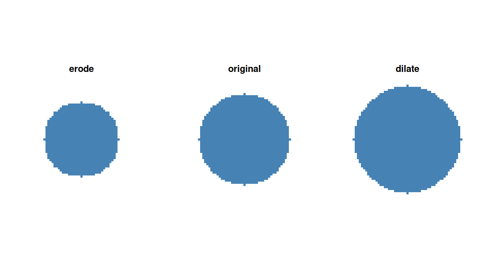
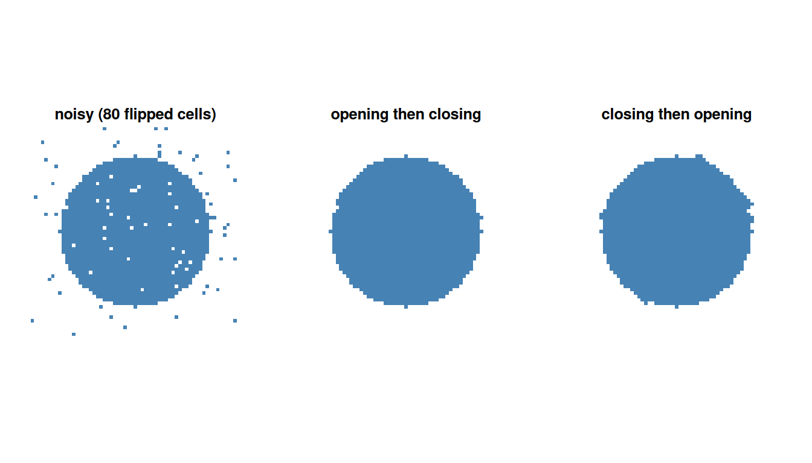
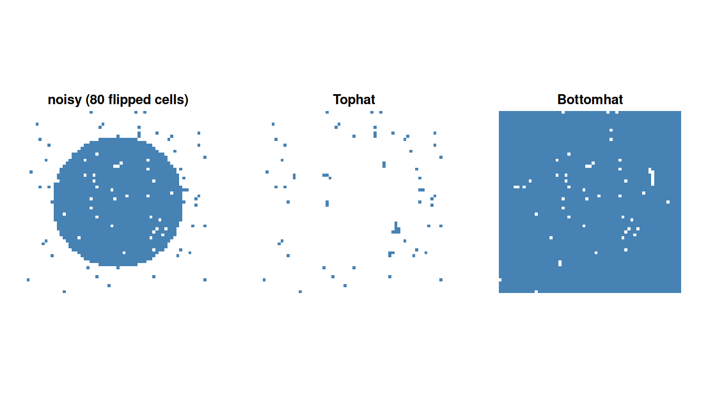
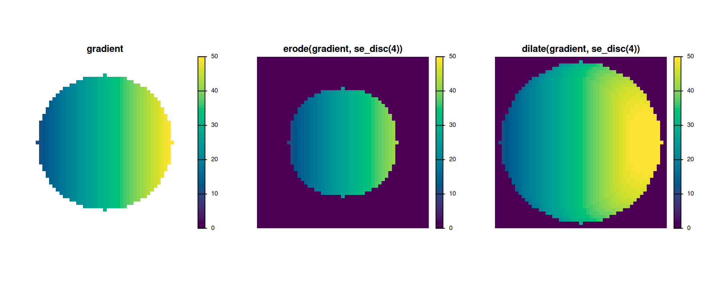
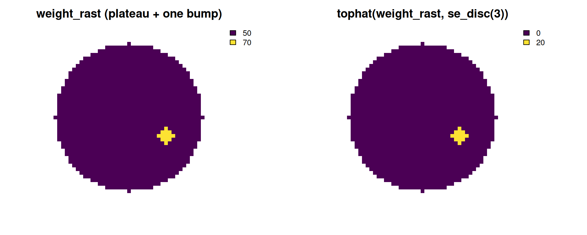
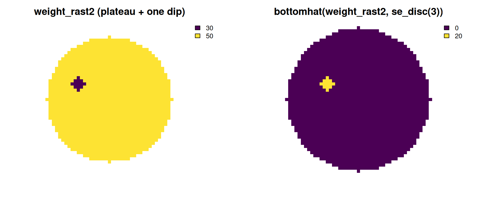
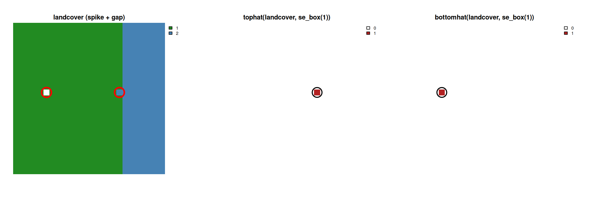
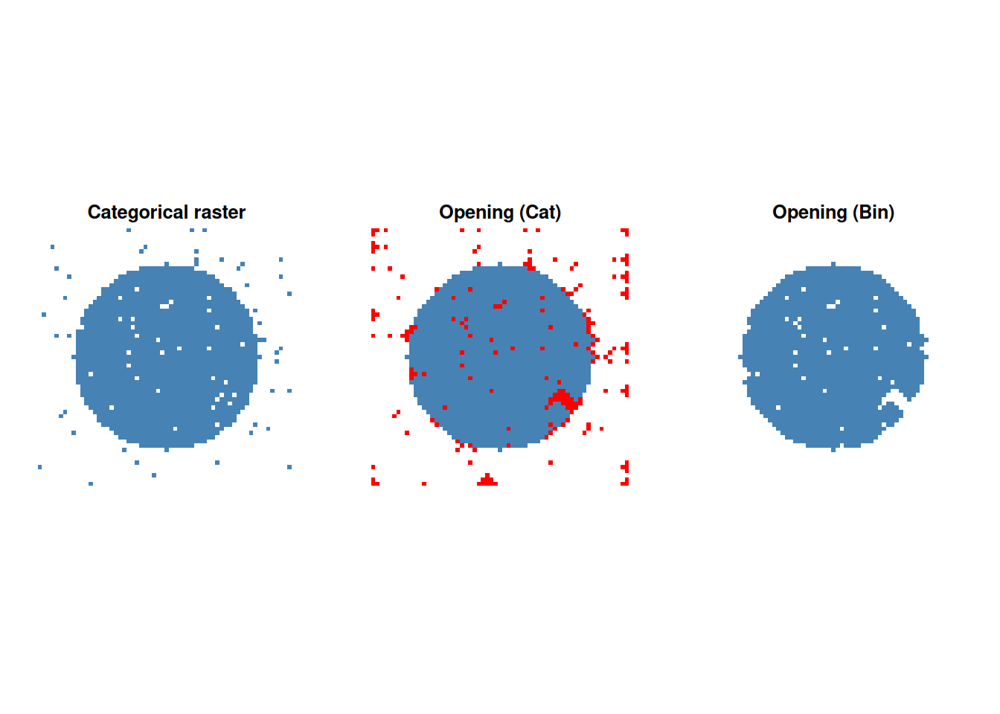

# 2. Morphological Operators

``` r

library(gridmorph)
library(terra)
```

`gridmorph` exposes six standard morphological operators -
[`erode()`](https://nkaza.github.io/gridmorph/reference/erode.md),
[`dilate()`](https://nkaza.github.io/gridmorph/reference/dilate.md),
[`opening()`](https://nkaza.github.io/gridmorph/reference/opening.md),
[`closing()`](https://nkaza.github.io/gridmorph/reference/closing.md),
[`tophat()`](https://nkaza.github.io/gridmorph/reference/tophat.md),
[`bottomhat()`](https://nkaza.github.io/gridmorph/reference/bottomhat.md) -
directly on `terra` SpatRaster objects, something `terra` itself doesn’t
provide with configurable structuring elements. This vignette is a full
tour of them, focused specifically on the part that’s easy to get wrong:
**what each operator actually means changes depending on whether the
input raster is binary, continuous, or categorical**, and that’s not
just a detail - two of the six operators
([`tophat()`](https://nkaza.github.io/gridmorph/reference/tophat.md),
[`bottomhat()`](https://nkaza.github.io/gridmorph/reference/bottomhat.md))
compute a genuinely different kind of result for categorical input than
for the other two.

## 1 Structuring elements

Every operator takes a `kernel` argument: a plain matrix where `1`
includes a cell in the structuring element’s footprint and `NA` excludes
it (matching
[`terra::focal()`](https://rspatial.github.io/terra/reference/focal.html)’s
own `w` convention directly). Three named shortcuts build the common
shapes:

``` r

se_box(2)      # a 5x5 square
```

         [,1] [,2] [,3] [,4] [,5]
    [1,]    1    1    1    1    1
    [2,]    1    1    1    1    1
    [3,]    1    1    1    1    1
    [4,]    1    1    1    1    1
    [5,]    1    1    1    1    1

``` r

se_disc(2)     # a Euclidean disc of radius 2
```

         [,1] [,2] [,3] [,4] [,5]
    [1,]   NA   NA    1   NA   NA
    [2,]   NA    1    1    1   NA
    [3,]    1    1    1    1    1
    [4,]   NA    1    1    1   NA
    [5,]   NA   NA    1   NA   NA

Any hand-built matrix works too, as long as its non-`NA` entries are all
exactly `1`. The operators reject anything else with a clear error
rather than silently misbehaving.

## 2 Binary masks

This is the operators’ original, still fully supported case: `1` =
inside the shape, `0`/`NA` = outside.
[`erode()`](https://nkaza.github.io/gridmorph/reference/erode.md)
shrinks a shape by one structuring-element radius;
[`dilate()`](https://nkaza.github.io/gridmorph/reference/dilate.md)
grows it:

``` r

r <- rast(nrows = 61, ncols = 61, xmin = 0, xmax = 61, ymin = 0, ymax = 61, crs = "local")
cx <- init(r, "x") - 30.5
cy <- init(r, "y") - 30.5
disk <- ifel(sqrt(cx^2 + cy^2) <= 22, 1, 0)

par(mfrow = c(1, 3))
plot(erode(disk, se_disc(4)), col = c("white", "steelblue"), legend = FALSE, axes = FALSE, main = "erode")
plot(disk, col = c("white", "steelblue"), legend = FALSE, axes = FALSE, main = "original")
plot(dilate(disk, se_disc(4)), col = c("white", "steelblue"), legend = FALSE, axes = FALSE, main = "dilate")
```



[`opening()`](https://nkaza.github.io/gridmorph/reference/opening.md)
(erode then dilate) removes small bright features narrower than the
structuring element without shrinking the shape overall;
[`closing()`](https://nkaza.github.io/gridmorph/reference/closing.md)
(dilate then erode) fills small dark gaps without growing it. Both
compose directly - `opening(mask, k)` is exactly
`dilate(erode(mask, k), k)`, not an independent implementation - which
makes them a natural denoising pair for classification noise: random
single-cell flips (both spurious “on” cells and spurious “off” holes)
mostly disappear after
[`opening()`](https://nkaza.github.io/gridmorph/reference/opening.md)
then
[`closing()`](https://nkaza.github.io/gridmorph/reference/closing.md):

``` r

set.seed(1)
noisy <- disk
flipped <- sample(ncell(noisy), 80)
values(noisy)[flipped] <- 1 - values(noisy)[flipped]

cleaned1 <- closing(opening(noisy, se_disc(1)), se_disc(1))
cleaned2 <- opening(closing(noisy, se_disc(1)), se_disc(1))

par(mfrow = c(1, 3))
plot(noisy, col = c("white", "steelblue"), legend = FALSE, axes = FALSE, main = "noisy (80 flipped cells)")
plot(cleaned1, col = c("white", "steelblue"), legend = FALSE, axes = FALSE, main = "opening then closing")
plot(cleaned2, col = c("white", "steelblue"), legend = FALSE, axes = FALSE, main = "closing then opening")
```



``` r

cat("cells differing from the true disk \n",
     "noisy:", sum(values(noisy) != values(disk)), "\n",
     "O-C:", sum(values(cleaned1) != values(disk)), "\n",
     "C-O:", sum(values(cleaned2) != values(disk)))
```

    cells differing from the true disk
     noisy: 80
     O-C: 7
     C-O: 19

Note however, that these operators are not commutative.

[`tophat()`](https://nkaza.github.io/gridmorph/reference/tophat.md)
(`k AND NOT opening(k)`) highlights exactly the small bright features
[`opening()`](https://nkaza.github.io/gridmorph/reference/opening.md)
removed;
[`bottomhat()`](https://nkaza.github.io/gridmorph/reference/bottomhat.md)
(`closing(k) AND NOT k`) highlights exactly the small dark gaps
[`closing()`](https://nkaza.github.io/gridmorph/reference/closing.md)
filled. Both return a `0`/`1` raster, same grid as the input.

``` r

h1 <- tophat(noisy, se_box(1))
h2 <- bottomhat(noisy, se_box(1))

par(mfrow = c(1, 3))
plot(noisy, col = c("white", "steelblue"), legend = FALSE, axes = FALSE, main = "noisy (80 flipped cells)")
plot(h1, col = c("white", "steelblue"), legend = FALSE, axes = FALSE, main = "Tophat")
plot(h2, col = c("white", "steelblue"), legend = FALSE, axes = FALSE, main = "Bottomhat")
```



## 3 Continuous rasters

None of the six operators require a 0/1 binary raster
[`erode()`](https://nkaza.github.io/gridmorph/reference/erode.md)/[`dilate()`](https://nkaza.github.io/gridmorph/reference/dilate.md)
are
[`focal()`](https://rspatial.github.io/terra/reference/focal.html)-based
local-minimum/local-maximum filters with no binarization step, so on
continuous input they compute ordinary *grayscale/continuous*
morphology - a standard generalization of the binary case.
[`opening()`](https://nkaza.github.io/gridmorph/reference/opening.md)/[`closing()`](https://nkaza.github.io/gridmorph/reference/closing.md)/[`tophat()`](https://nkaza.github.io/gridmorph/reference/tophat.md)/[`bottomhat()`](https://nkaza.github.io/gridmorph/reference/bottomhat.md)
inherit that directly, since each is built from
[`erode()`](https://nkaza.github.io/gridmorph/reference/erode.md)/[`dilate()`](https://nkaza.github.io/gridmorph/reference/dilate.md)
alone. On a smooth left-to-right gradient,
[`erode()`](https://nkaza.github.io/gridmorph/reference/erode.md)
visibly pulls the whole surface down toward the background outside the
shape (a local *minimum* filter), and
[`dilate()`](https://nkaza.github.io/gridmorph/reference/dilate.md)
pulls it up (a local *maximum* filter):

``` r

disk_r <- rast(nrows = 51, ncols = 51, xmin = 0, xmax = 51, ymin = 0, ymax = 51, crs = "local")
gcx <- init(disk_r, "x") - 25.5
gcy <- init(disk_r, "y") - 25.5
disk_mask <- ifel(sqrt(gcx^2 + gcy^2) <= 20, 1, 0)
gradient <- ifel(disk_mask == 1, gcx + 30, NA)
eroded <- erode(gradient, se_disc(4))
dilated <- dilate(gradient, se_disc(4))
shared_range <- range(c(values(eroded), values(gradient), values(dilated)), na.rm = TRUE)

par(mfrow = c(1, 3))
plot(gradient, col = hcl.colors(50, "viridis"), range = shared_range, axes = FALSE, main = "gradient")
plot(eroded, col = hcl.colors(50, "viridis"), range = shared_range, axes = FALSE, main = "erode(gradient, se_disc(4))")
plot(dilated, col = hcl.colors(50, "viridis"), range = shared_range, axes = FALSE, main = "dilate(gradient, se_disc(4))")
```



Note that
[`erode()`](https://nkaza.github.io/gridmorph/reference/erode.md)/[`dilate()`](https://nkaza.github.io/gridmorph/reference/dilate.md)
fill the WHOLE raster with a real, defined value (the dark background
outside the shrunk/grown shape is `0`, not `NA`) - they reshape the
raster over its entire extent, the same way
[`erode()`](https://nkaza.github.io/gridmorph/reference/erode.md)/[`dilate()`](https://nkaza.github.io/gridmorph/reference/dilate.md)
always have for a plain binary mask.
[`tophat()`](https://nkaza.github.io/gridmorph/reference/tophat.md)/[`bottomhat()`](https://nkaza.github.io/gridmorph/reference/bottomhat.md)
are different: their job is to flag a specific *feature*, so their
output stays `NA` whenever `mask` itself was `NA`, rather than asserting
a defined `0` residual for a location that was never part of the shape
to begin with. A flat plateau with one small, deliberate bump makes the
real-valued residual unambiguous -
[`opening()`](https://nkaza.github.io/gridmorph/reference/opening.md)
(with a structuring element bigger than the bump) erases it completely,
so [`tophat()`](https://nkaza.github.io/gridmorph/reference/tophat.md)
flags exactly the bump and nothing else:

``` r

plateau <- ifel(disk_mask == 1, 50, NA)
bump <- ifel(sqrt((gcx - 10)^2 + (gcy + 5)^2) <= 2, 20, 0)  # radius 2, smaller than the se_disc(3) below
weight_rast <- plateau + bump

weight_th <- tophat(weight_rast, se_disc(3))
par(mfrow = c(1, 2))
plot(weight_rast, col = hcl.colors(50, "viridis"), axes = FALSE, main = "weight_rast (plateau + one bump)")
plot(weight_th, col = hcl.colors(50, "viridis"), axes = FALSE, main = "tophat(weight_rast, se_disc(3))")
```



[`tophat()`](https://nkaza.github.io/gridmorph/reference/tophat.md)’s
definition (`k - opening(k)`) is exactly that: a real-valued residual
(here, exactly `20` at the bump, matching its own height above the
plateau) highlighting where the raster’s own values exceed its own
opening, not a binarized approximation of one. On a 0/1 binary raster it
reduces exactly to the familiar `k AND NOT opening(k)` - not
approximately, since `opening(x) <= x` pointwise whenever the
structuring element includes its own centre (true for every named
shortcut at every radius).
[`bottomhat()`](https://nkaza.github.io/gridmorph/reference/bottomhat.md)
is the mirror image - a small *dip* below the plateau, filled back in by
[`closing()`](https://nkaza.github.io/gridmorph/reference/closing.md):

``` r

dip <- ifel(sqrt((gcx + 10)^2 + (gcy - 5)^2) <= 2, -20, 0)
weight_rast2 <- plateau + dip

weight_bh <- bottomhat(weight_rast2, se_disc(3))
par(mfrow = c(1, 2))
plot(weight_rast2, col = hcl.colors(50, "viridis"), axes = FALSE, main = "weight_rast2 (plateau + one dip)")
plot(weight_bh, col = hcl.colors(50, "viridis"), axes = FALSE, main = "bottomhat(weight_rast2, se_disc(3))")
```



## 4 Categorical rasters

Categorical rasters
([`terra::is.factor()`](https://rspatial.github.io/terra/reference/is.bool.html) -
discrete, unordered class codes, e.g. a land-cover classification) are a
genuinely different case. Taking the local min/max of the raw CODE
NUMBERS would only mean something spatially if those codes happened to
carry a real order, and for nominal categories they don’t - there’s no
meaningful sense in which land-cover code `1` (say, forest) is “less
than” code `3` (say, urban). So
[`erode()`](https://nkaza.github.io/gridmorph/reference/erode.md)/[`dilate()`](https://nkaza.github.io/gridmorph/reference/dilate.md)
switch to standard label-image morphology instead:

- **[`erode()`](https://nkaza.github.io/gridmorph/reference/erode.md)**:
  a cell keeps its own label only if every cell in its neighbourhood
  shares that exact label; otherwise it becomes unlabelled (`NA`).
  Equivalent to eroding each class’s own binary mask separately and
  taking the union - classes are mutually exclusive, so there is never
  an overlap to resolve.
- **[`dilate()`](https://nkaza.github.io/gridmorph/reference/dilate.md)**:
  an already-labelled cell is left untouched; an unlabelled (`NA`) cell
  is filled with the majority label among its labelled neighbours.
  Restricting the fill to `NA` cells only is what keeps this monotonic
  (the defining property of dilation - it only ever grows into
  background, never reassigns existing foreground). A blind majority
  filter applied everywhere would instead be a smoothing operation,
  relabelling already-correct interior cells near a strong neighbouring
  majority.

One landcover raster with a stray class-2 cell poking into class-1
territory AND a one-cell interior gap - far enough from the class
boundary that it’s a genuine gap, not just an eroded edge - shows all
four operators at once. The circles mark the two cells of interest, in
the same spatial position in every panel:

``` r

n <- 25
landcover <- rast(nrows = n, ncols = n, xmin = 0, xmax = n, ymin = 0, ymax = n, crs = "local")
values(landcover) <- 1
landcover[, 19:25] <- 2       # a solid class-2 block on the right
landcover[12, 18] <- 2        # a stray class-2 cell poking into class 1
landcover[12, 6] <- NA        # an interior gap, well away from the class boundary
landcover <- as.factor(landcover)
k <- se_box(1)

spike_xy <- xyFromCell(landcover, cellFromRowCol(landcover, 12, 18))
notch_xy <- xyFromCell(landcover, cellFromRowCol(landcover, 12, 6))

par(mfrow = c(1, 3))
plot(landcover, col = c("forestgreen", "steelblue"), axes = FALSE, main = "landcover (spike + gap)")
points(rbind(spike_xy, notch_xy), cex = 4, col = "red", lwd = 3)

plot(tophat(landcover, k), col = c("white", "firebrick"), axes = FALSE, main = "tophat(landcover, se_box(1))")
points(spike_xy, cex = 4, col = "black", lwd = 2)

plot(bottomhat(landcover, k), col = c("white", "firebrick"), axes = FALSE, main = "bottomhat(landcover, se_box(1))")
points(notch_xy, cex = 4, col = "black", lwd = 2)
```



[`opening()`](https://nkaza.github.io/gridmorph/reference/opening.md)
(erode then dilate) removes the stray cell entirely - too thin to
survive erosion, then not re-grown by dilation since it isn’t adjacent
to the rest of class 2 - and
[`tophat()`](https://nkaza.github.io/gridmorph/reference/tophat.md)
(`!is.na(mask) & is.na(opening(mask))`, the label-image analogue of
`mask AND NOT opening(mask)`) flags exactly that one cell, nothing else.
The gap works the same way in the other direction:
[`closing()`](https://nkaza.github.io/gridmorph/reference/closing.md)
(dilate then erode) fills it back in from its class-1 neighbours, and
[`bottomhat()`](https://nkaza.github.io/gridmorph/reference/bottomhat.md)
(`is.na(mask) & !is.na(closing(mask))`) flags exactly that cell.
Subtracting category codes the way the continuous residual does would be
meaningless for either direction (what would “class 1 minus class 2”
even mean?) -
[`tophat()`](https://nkaza.github.io/gridmorph/reference/tophat.md)/[`bottomhat()`](https://nkaza.github.io/gridmorph/reference/bottomhat.md)
return a boolean flag for categorical input, `0`/`1` but not itself
categorical, rather than a numeric residual.

To erode or dilate a single class on its own terms - rather than the
symmetric, every-class-at-once behaviour above - convert that class to
its own binary mask first (e.g. `landcover == 2`) and run the operator
on that instead.

## 5 What each operator means, by raster type

|  | binary (0/1) | continuous | categorical |
|----|----|----|----|
| [`erode()`](https://nkaza.github.io/gridmorph/reference/erode.md) | shrink the shape by one SE radius | local minimum filter (grayscale erosion) | keep a label only if the whole neighbourhood agrees; else `NA` |
| [`dilate()`](https://nkaza.github.io/gridmorph/reference/dilate.md) | grow the shape by one SE radius | local maximum filter (grayscale dilation) | fill `NA` cells by majority vote; labelled cells untouched |
| [`opening()`](https://nkaza.github.io/gridmorph/reference/opening.md) | remove small bright features | grayscale opening (erode then dilate) | remove small/thin single-class regions |
| [`closing()`](https://nkaza.github.io/gridmorph/reference/closing.md) | fill small dark gaps | grayscale closing (dilate then erode) | fill small gaps within a class region |
| [`tophat()`](https://nkaza.github.io/gridmorph/reference/tophat.md) | `mask AND NOT opening(mask)`, `0`/`1` | `mask - opening(mask)`, real-valued | `1` where a label was removed by [`opening()`](https://nkaza.github.io/gridmorph/reference/opening.md) |
| [`bottomhat()`](https://nkaza.github.io/gridmorph/reference/bottomhat.md) | `closing(mask) AND NOT mask`, `0`/`1` | `closing(mask) - mask`, real-valued | `1` where a gap was filled by [`closing()`](https://nkaza.github.io/gridmorph/reference/closing.md) |

The first two columns are a genuine generalization: grayscale morphology
(local min/max) restricted to exactly two values reproduces binary
morphology exactly, not approximately - continuous *contains* binary as
a special case. However Categorical rasters are different. Operators
have to be has to be a different rule built on a different assumption
(every class treated symmetrically, none privileged as background). This
might be particularly problematic if a binary raster is converted to a
categorical. Looks can be deceiving, if we only pay attention to
category 1.

``` r

disk_factor <- as.factor(noisy)
r1 <- opening(disk_factor, se_diamond(2))
r2 <- opening(noisy, se_diamond(2))

par(mfrow = c(1, 3))
plot(disk_factor, col = c("white", "steelblue"), legend = FALSE, axes = FALSE, main = "Categorical raster", colNA = 'red')
plot(r1, col = c("white", "steelblue"), legend = FALSE, axes = FALSE, main = "Opening (Cat)", colNA = "red")
plot(r2, col = c("white", "steelblue"), legend = FALSE, axes = FALSE, main = "Opening (Bin)", colNA = "red")
```



## 6 Practical notes

**`NA` = hole**, consistently: an `NA` cell in a binary or continuous
mask is treated as background (the same as `0`) for
[`erode()`](https://nkaza.github.io/gridmorph/reference/erode.md)/[`dilate()`](https://nkaza.github.io/gridmorph/reference/dilate.md);
in a categorical raster, `NA` is the *only* thing treated as
background - every other class code, including `0` if it’s one of the
raster’s own levels, is a real, persisting label (see
[`?gridmorph`](https://nkaza.github.io/gridmorph/reference/gridmorph-package.md)
for how this compares to the index functions’ own, deliberately
different, “`0` is always a hole” convention).

**The raster’s own true edge is handled correctly**, not silently
treated as either “definitely background” or “definitely not a
boundary”: a shape reaching the edge of the raster erodes there exactly
as it would next to an interior `NA` hole, and a categorical raster’s
own edge behaves the same way an adjacent unknown region would (verified
directly against
[`terra::focal()`](https://rspatial.github.io/terra/reference/focal.html)’s
own edge-padding defaults, which would otherwise under- or over-erode a
shape that touches the raster’s extent).

**Built on
[`terra::focal()`](https://rspatial.github.io/terra/reference/focal.html),
chunk-aware on disk-backed rasters the same way
[`terra::distance()`](https://rspatial.github.io/terra/reference/distance.html)/[`terra::patches()`](https://rspatial.github.io/terra/reference/patches.html)
already are** - not `mmand`, despite
`mmand::erode()`/[`dilate()`](https://nkaza.github.io/gridmorph/reference/dilate.md)
being somewhat faster per call at sizes that already fit in memory.
`mmand` operates on an in-memory array, full stop; there’s no way to run
it on a raster too large to fit in memory, which matters more for this
package than the speed difference.

## 7 See also

[`vignette("a-basic-usage")`](https://nkaza.github.io/gridmorph/articles/a-basic-usage.md)
covers the thirteen shape indices and how `weighted` works for them;
[`vignette("c-comparison-with-shapeindices")`](https://nkaza.github.io/gridmorph/articles/c-comparison-with-shapeindices.md)
compares `gridmorph` against its vector-based sibling package on
accuracy, speed, and memory.
