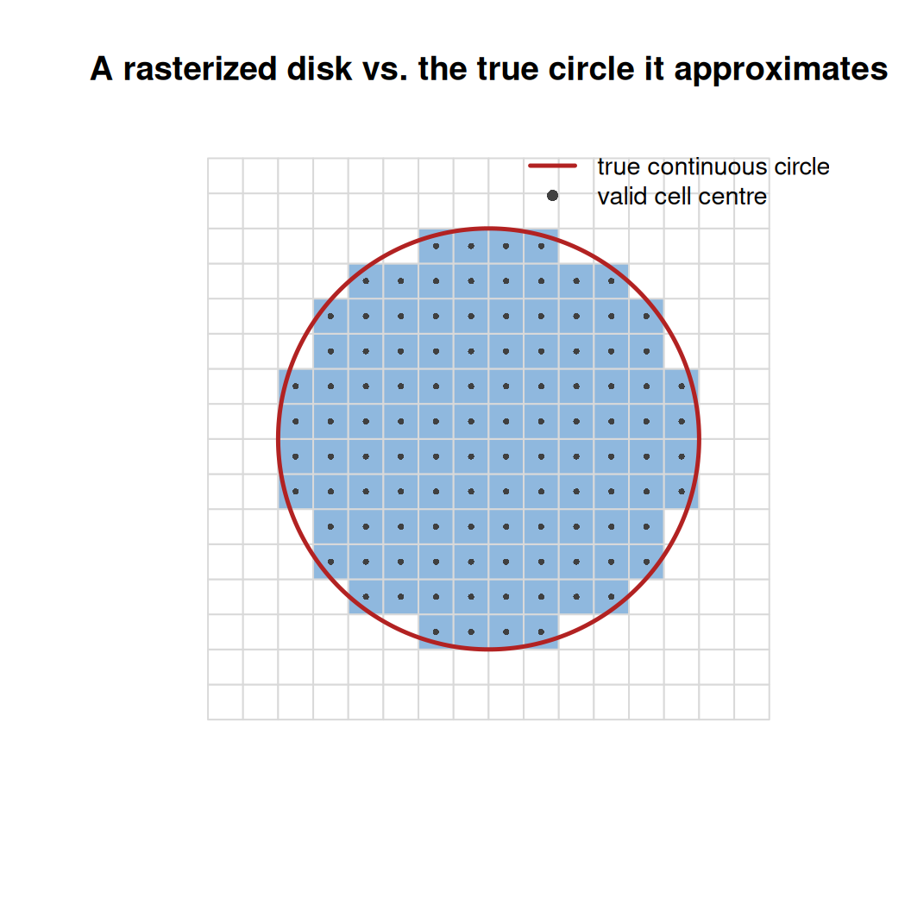
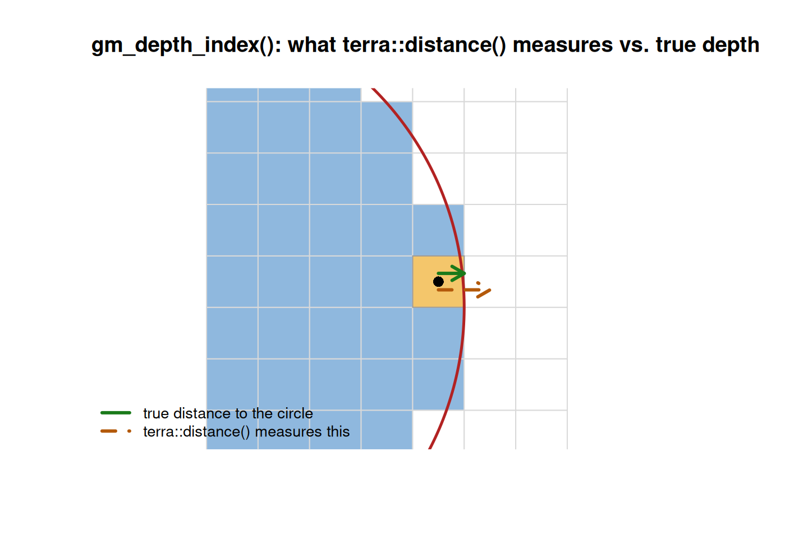
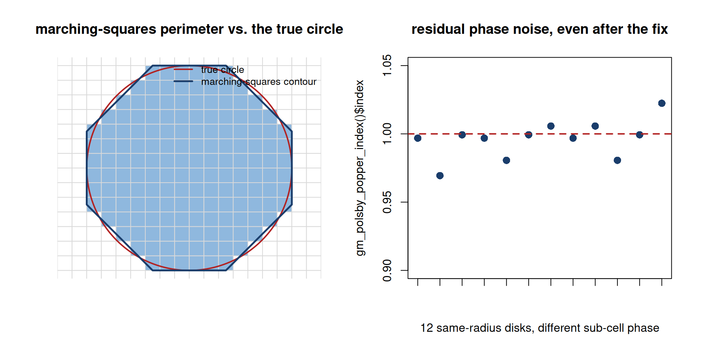
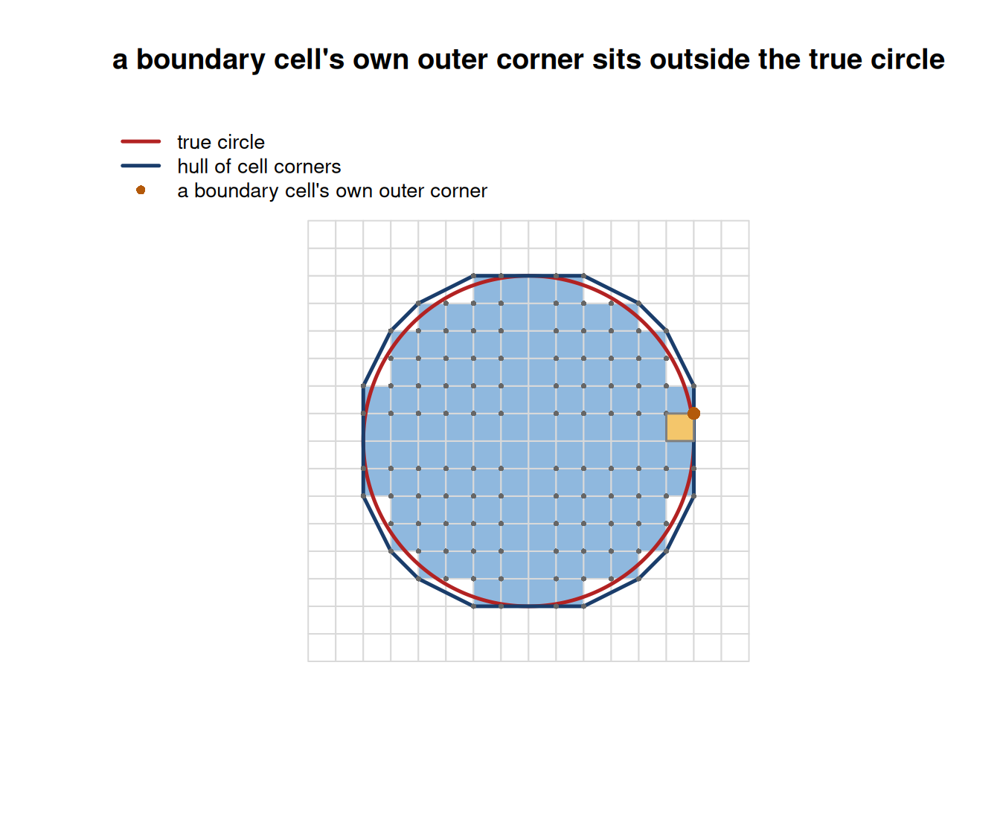
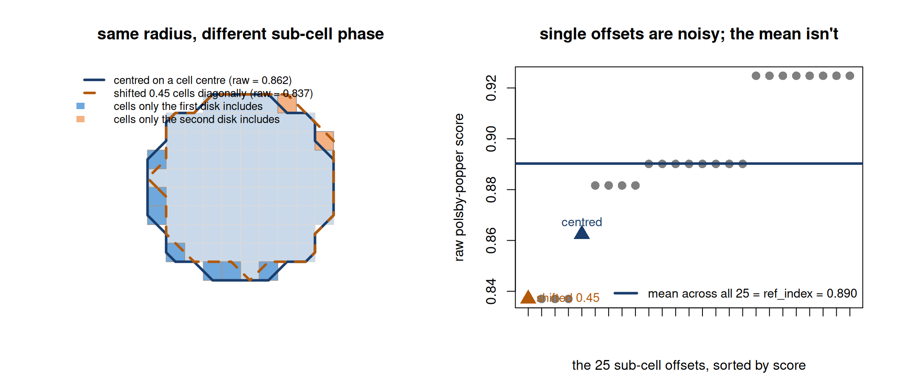
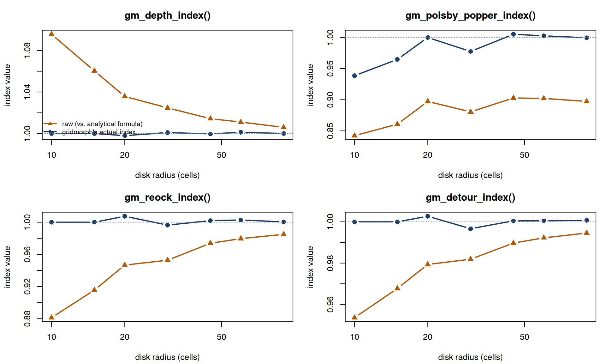

# 4. Resolution-Matched References

``` r

library(gridmorph)
library(terra)
```

Four of `gridmorph`’s thirteen indices -
[`gm_depth_index()`](https://nkaza.github.io/gridmorph/reference/gm_depth_index.md),
[`gm_polsby_popper_index()`](https://nkaza.github.io/gridmorph/reference/gm_polsby_popper_index.md),
[`gm_reock_index()`](https://nkaza.github.io/gridmorph/reference/gm_reock_index.md),
[`gm_detour_index()`](https://nkaza.github.io/gridmorph/reference/gm_detour_index.md) -
work by comparing something measured on the raster against a reference
value for a perfect circle. In each of these four, that reference used
to be a plain closed-form formula: the textbook constant a smooth,
infinitely precise circle would give. At any finite raster resolution,
that turned out to be the wrong number to compare against - even a
perfectly rasterized disk scored measurably below 1. This vignette shows
the symptom, explains why it happens, and describes the fix now built
into all four functions.

## 1 The symptom

A disk is the one shape every one of these four indices should score at
(or extremely close to) 1 - that is each index’s own definition of
“optimal”. Reconstructing what each function’s raw, pre-reference-fix
formula would have given - using only the geometric quantities each
function already returns (`area`, `perimeter`, `mbc_area`,
`hull_perimeter`) - shows all four undershooting 1 well outside any
reasonable rounding:

``` r

make_disk <- function(n = 81, radius = 30) {
  r <- rast(nrows = n, ncols = n, xmin = 0, xmax = n, ymin = 0, ymax = n, crs = "local")
  cx <- init(r, "x") - n / 2; cy <- init(r, "y") - n / 2
  ifel(sqrt(cx^2 + cy^2) <= radius, 1, 0)
}
disk <- make_disk()

depth   <- gm_depth_index(disk)
pp      <- gm_polsby_popper_index(disk)
reock   <- gm_reock_index(disk)
detour  <- gm_detour_index(disk)

raw_scores <- c(
  depth          = depth$mean_depth / (sqrt(depth$area / pi) / 3),
  polsby_popper  = 4 * pi * pp$area / pp$perimeter^2,
  reock          = reock$area / reock$mbc_area,
  detour         = 2 * sqrt(pi * detour$area) / detour$hull_perimeter
)
knitr::kable(round(raw_scores, 3), col.names = "raw score (a perfect disk should give 1)")
```

|               | raw score (a perfect disk should give 1) |
|:--------------|-----------------------------------------:|
| depth         |                                    1.025 |
| polsby_popper |                                    0.880 |
| reock         |                                    0.953 |
| detour        |                                    0.982 |

Comparing this to what these four functions actually return today shows
the fix in effect - every one lands close to 1:

``` r

fixed_scores <- c(depth = depth$index, polsby_popper = pp$index,
                   reock = reock$index, detour = detour$index)
knitr::kable(round(fixed_scores, 3), col.names = "gridmorph's actual index")
```

|               | gridmorph’s actual index |
|:--------------|-------------------------:|
| depth         |                    1.001 |
| polsby_popper |                    0.978 |
| reock         |                    0.996 |
| detour        |                    0.997 |

## 2 Why a perfect disk doesn’t score exactly 1

The four functions fall into two different mechanisms, both boiling down
to the same root cause: **a raster is a set of finite cells, not a
continuous shape**, so anything measured from it - a distance, a
perimeter, an area by pixel count - is only ever an approximation of the
matching continuous quantity, and that approximation doesn’t hit the
continuous formula’s own constant exactly. Zooming in on a small
rasterized disk against the true circle it approximates makes this
concrete - the shape these four indices actually measure is the blue
stair-step region, not the smooth red curve:



Figure 1

**[`gm_depth_index()`](https://nkaza.github.io/gridmorph/reference/gm_depth_index.md)**:
`mean_depth` comes from
[`terra::distance()`](https://rspatial.github.io/terra/reference/distance.html),
which measures from a cell’s own *centre* to the nearest invalid cell’s
*centre* - not to the true boundary curve. That’s a systematically
larger quantity than true distance-to-boundary, most so right at the
boundary and decaying (but never fully vanishing at any finite
resolution) toward the interior. Zooming in on one boundary cell shows
the gap directly - the true distance to the circle (green) is shorter
than the distance
[`terra::distance()`](https://rspatial.github.io/terra/reference/distance.html)
actually measures, to the centre of the nearest invalid cell (orange,
dashed):



Figure 2

**[`gm_polsby_popper_index()`](https://nkaza.github.io/gridmorph/reference/gm_polsby_popper_index.md)**:
perimeter comes from marching squares
([`terra::as.contour()`](https://rspatial.github.io/terra/reference/contour.html)),
a technique built to reconstruct a smooth boundary from a
*smoothly-sampled* field. A binary raster mask was never smoothly
sampled in the first place - there’s no genuine sub-cell signal for it
to interpolate - so the reconstructed perimeter carries a real,
persistent overestimate that does not shrink away at finer resolutions,
on top of substantial noise depending on exactly how the shape’s
boundary happens to sit against the grid. The left panel shows the
reconstructed contour (dark blue) cutting corners against the true
circle in some places and bulging past it in others; the right panel
shows twelve disks of the *same* radius, each centred a random fraction
of a cell differently, and how much that alone moves the (already
resolution-matched) index:



Figure 3

**[`gm_reock_index()`](https://nkaza.github.io/gridmorph/reference/gm_reock_index.md)
/
[`gm_detour_index()`](https://nkaza.github.io/gridmorph/reference/gm_detour_index.md)**:
both compare a pixel-COUNT area (or a raster-derived convex hull)
against an EXACTLY-computed reference (the minimum bounding circle’s
area, or a perfect circle’s analytical perimeter). Pixel counting alone
always slightly undershoots a shape’s true continuous area near its own
boundary, while the exact reference carries no matching imprecision - so
the two sides of the ratio are measured by two different conventions
that don’t cancel by themselves. Under centre-based rasterization, a
boundary cell’s own far corner can sit outside the true circle - the
hull built from those corners (dark blue) visibly bulges past it:



Figure 4

## 3 The fix: measure the reference the same way

The common fix, used identically by all four: instead of comparing the
shape’s raster-measured score against a pure formula, build an *actual*
rasterized disk at the input’s own cell size and area, run it through
the exact same measurement pipeline the shape itself just went through,
and divide by that instead. Since both sides of the ratio now carry the
same measurement artifacts, those artifacts cancel out rather than
leaking into the final index:

``` r

c(polsby_popper_ref = pp$ref_index, reock_ref = reock$ref_index, detour_ref = detour$ref_index)
```

    polsby_popper_ref         reock_ref        detour_ref
            0.9007295         0.9561244         0.9851745 

Each of these `ref_index` values is exactly what a same-resolution
rasterized disk itself scores on the *raw*, uncorrected formula - the
same numbers as the “raw score” table above, just for a disk built to
match the input’s own resolution rather than the input itself.
[`gm_depth_index()`](https://nkaza.github.io/gridmorph/reference/gm_depth_index.md)’s
own reference is the analogous quantity - a same-resolution disk’s own
mean distance-to-boundary - returned as `ref_depth` rather than
`ref_index`, since it’s a physical distance, not a dimensionless score.

One index needs a further refinement.
[`gm_polsby_popper_index()`](https://nkaza.github.io/gridmorph/reference/gm_polsby_popper_index.md)’s
marching-squares perimeter is sensitive enough to exactly where a
shape’s boundary falls against the pixel grid that a *single* reference
disk isn’t a reliable stand-in - two disks of the *same radius*, centred
a fraction of a cell apart, can give visibly different raw scores. The
left panel below overlays two such disks directly: one centred on a cell
centre (solid dark outline), one shifted `0.45` cells diagonally (dashed
orange outline) - the blue-shaded cells are only in the first disk, the
orange-shaded cells only in the second. That’s the entire source of the
difference between their raw scores. The right panel shows where those
two scores (triangles) sit among the full 25-point grid of sub-cell
offsets
[`gm_polsby_popper_index()`](https://nkaza.github.io/gridmorph/reference/gm_polsby_popper_index.md)
actually averages over: scattered on both sides of the mean (the dark
blue line) - no single one of those 25 points would make a reliable
reference on its own, but their mean is stable enough to use:



Figure 5

That reference is instead averaged over a grid of 25 sub-cell offsets,
which was enough to keep the corrected index within about half a percent
of 1 across every resolution checked.
[`gm_reock_index()`](https://nkaza.github.io/gridmorph/reference/gm_reock_index.md)
and
[`gm_detour_index()`](https://nkaza.github.io/gridmorph/reference/gm_detour_index.md)
don’t need this: their own raw scores were checked directly and shown to
vary by only a few thousandths across the same offsets, so a single
reference disk is already a reliable comparison.

None of these four functions expose a way to opt back into the old,
purely-analytical comparison - the number it used to give was not a
different valid choice, it was measurably the wrong one for a rasterized
shape at any finite resolution.

Running all four functions on disks of increasing radius shows what the
fix buys, and where it doesn’t:
[`gm_depth_index()`](https://nkaza.github.io/gridmorph/reference/gm_depth_index.md)/[`gm_reock_index()`](https://nkaza.github.io/gridmorph/reference/gm_reock_index.md)/
[`gm_detour_index()`](https://nkaza.github.io/gridmorph/reference/gm_detour_index.md)’s
raw scores (orange) converge toward 1 only slowly, needing a genuinely
large radius to get close - the resolution-matched `index` (blue) is
already tight at every radius shown, including the smallest.
[`gm_polsby_popper_index()`](https://nkaza.github.io/gridmorph/reference/gm_polsby_popper_index.md)’s
raw score doesn’t converge toward 1 at all, even at radius 90 - the
non-vanishing bias described above - while its own resolution-matched
`index` stays close to 1 throughout, with the visible wobble being
exactly the residual phase noise from the figure above:



Figure 6

## 4 What this doesn’t cover

[`gm_hull_ratio_index()`](https://nkaza.github.io/gridmorph/reference/gm_hull_ratio_index.md)
(`area / hull_area`) and
[`gm_exchange_index()`](https://nkaza.github.io/gridmorph/reference/gm_exchange_index.md)
(share of a shape’s own area inside a reference circle at its centroid)
are not part of this fix, and a rasterized disk still scores a little
below 1 on both:

``` r

c(hull_ratio = gm_hull_ratio_index(disk)$index, exchange = gm_exchange_index(disk)$index)
```

    hull_ratio   exchange
     0.9684174  0.9929103 

Both are self-referential - nowhere in either formula does an external
circle formula appear to be measured against.
[`gm_hull_ratio_index()`](https://nkaza.github.io/gridmorph/reference/gm_hull_ratio_index.md)
compares a shape to its *own* convex hull;
[`gm_exchange_index()`](https://nkaza.github.io/gridmorph/reference/gm_exchange_index.md)
compares a shape to a circle built from the shape’s *own* area and
centroid. A rasterized disk’s stair-step boundary genuinely isn’t
perfectly convex at the pixel level - real, tiny notches exist along it,
the same way a coastline traced at high enough zoom genuinely isn’t a
smooth curve. A same-resolution reference disk would show the same small
gap, not erase it, because there is nothing measured incorrectly here to
begin with. Both converge toward 1 as resolution increases, the ordinary
way any raster-native measurement converges toward its continuous limit.
